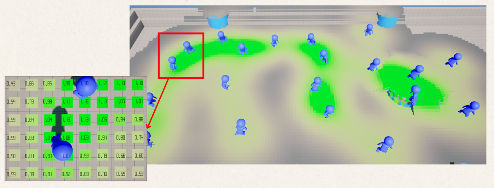

# Introdoction

## Overview

---

The Tactical Crowd AI Toolkit(TCAT) enables the creation of large-scale AI systems that make informed movement and navigation decisions using **GPU-Based** **influence maps**.
Designed for performance, it scales to hundreds -- if not thousands -- of simultaneous units, making it ideal for crowd-level decision making where traditional query-based approaches struggle.

유튜브 트레일러 첨부

## Why should you use our plugin “TCAT”?

---

TCAT은 언리얼의 전통적인 AI 시스템인 EQS보다 훨씬 빠르기 때문입니다.

아래와 같은 상황에서 성능 비교를 해보겠습니다.

### 성능비교 시나리오


 **빨강 ■ = 콘▲에 접근을 시도하는 AI**

 **파랑 ■ =**  **다가오는 적■의 접근을 저지하는 AI**

```
**성능 비교 환경**

- CPU: Intel(R) Core(TM) i7-14700(~2.1GHz)

- GPU: NVIDIA GeForce RTX 5060(8GB)

- RAM: 32GB DDR4
```


### 성능 비교: 2000명의 AI

[performance diff.mp4](media/performance_diff.mp4)

보시다시피, AI가 매우 많아졌을 때, 시간과 메모리 사용량 측면에서 TCAT이 EQS보다 훨씬 더 성능이 뛰어다나는 것을 보실 수 있습니다.


## What is a GPU-Based Influence map?

---

왜 EQS보다 TCAT이 더 빠를까요?

TCAT은 **GPU-Based Influence map**을 사용하기 때문입니다.


### Influence map이란?

---

Influence map은 게임 공간을 2D 격자로 나누고, 각 칸에 수치를 기록한 데이터 구조입니다.

각 칸에 얼마나 높은 수치를 기록할 것인지에 대한 기준은 사용자가 정하게 됩니다.

> 💡각 칸에 기록되는 수치를 **영향력**이라고 부릅니다.

<br>
예를 들어보겠습니다.

레벨에 여러 아군 AI들이 있습니다.

사용자는 “아군 AI가 밀집된 칸일수록 높은 수치(=높은 영향력)를 기록하라”라는 기준을 정합니다.

그렇다면, Influcen map은 아래와 같이 만들어집니다.

아군 AI가 밀집된 칸일수록, 높은 수치가 기록된 것을 볼 수 있습니다.(초록색일수록 높은 수치가 기록된 칸입니다.)



<br>
이 Influence map을 이용한다면, 다음과 같은 AI 로직들을 만들 수 있게됩니다.

- 아군 AI들이 밀집된 지역을 피해서 가는 적군 AI
- 아군 AI들이 밀집된 지역으로 돌진을 하는 몬스터 AI
- 아군 AI들이 최대한 밀집된 지역에 메테오를 떨어트리는 적군 AI
- 서로 최대한 모이려고 하는 아군 AI
- 그 외 등등

<br>
즉, **AI가 의사결정을 하는 데에 쓰는 전장 상황판**인 것입니다.

AI는 복잡한 연산 없이, 단지 Influence map을 참조 하는 것만으로 **빠른 시간안에** 의사결정을 할 수 있게 됩니다.


### GPU-Based Influence map이란?

---

지금까지는 Influence map에 대해 알아봤습니다.

그렇다면, **“GPU-Based”** Influence map은 뭘까요?

<br>
조금 전에, 2D 격자를 만들고, 각 칸에 수치를 기록해 Influence map을 만든다고 했습니다.

즉, 이 Influcence map은 보통 2차원 배열 형태로 저장이 됩니다.

이 배열의 모든 칸에 값을 기록하려면, 배열의 크기만큼 반복문을 순회해야 합니다.

예를 들어, 어떤 Influence map의 크기가 750 X 750이라면, 562,500번을 순회해야 하는거죠.

이것은 큰 병목이 될 수 있습니다.

<br>
그래서, TCAT은 Influece map에 값을 기록할 때, CPU가 아닌 GPU를 씁니다.

GPU는 병렬 처리에 특화돼있어, 모든 칸에 거의 동시에 값을 기록할 수 있기 때문입니다.

즉, 750X750 크기의 Influence map의 모든 칸에 값을 기록하는 것을 단 1번의 순회로 끝낼 수 있다는 것입니다.

(물론, 완벽한 1은 아닙니다만, 그래도 CPU보다 훨씬 빠르게 값을 기록할 수 있습니다.)

<br>
**이렇게 TCAT은 Influence map과 GPU를 활용함으로써, 매우 빠른 AI System을 만들었습니다.**

> Influence map에 대한 좀 더 자세한 이론적 설명은 이 [링크](https://www.gdcvault.com/play/1025243/Spatial-Knowledge-Representation-through-Modular)를 참고하세요.


## Key Features

---

- Includes an **Influence Volume** and **Influence Source Component** to create influence maps with just a few clicks.
- Computes influence maps every tick, dynamically switching between **GPU and CPU** based on detected bottlenecks.
- Built-in **2.5D spatial queries** including vision occlusion tests, height-aware sampling, and navigability checks.
- Supports **composite operations** on base influence maps, including addition, subtraction, multiplication, normalization, etc.
- Provides intuitive **Blueprints** and **Behavior Tree Services and Tasks** to asynchronously query influence maps.
- Debugging tools, Visual Logger, and Unreal Insights support
- High performance


## Vidoe Tutorials

---

유튜브 튜토리얼들


## Contact Us

---

📧 [over2ktech@gmail.com](mailto:over2ktech@gmail.com)

유튜브 채널

그 외 등등

> 💡For more details, click the items in the left side bar.
